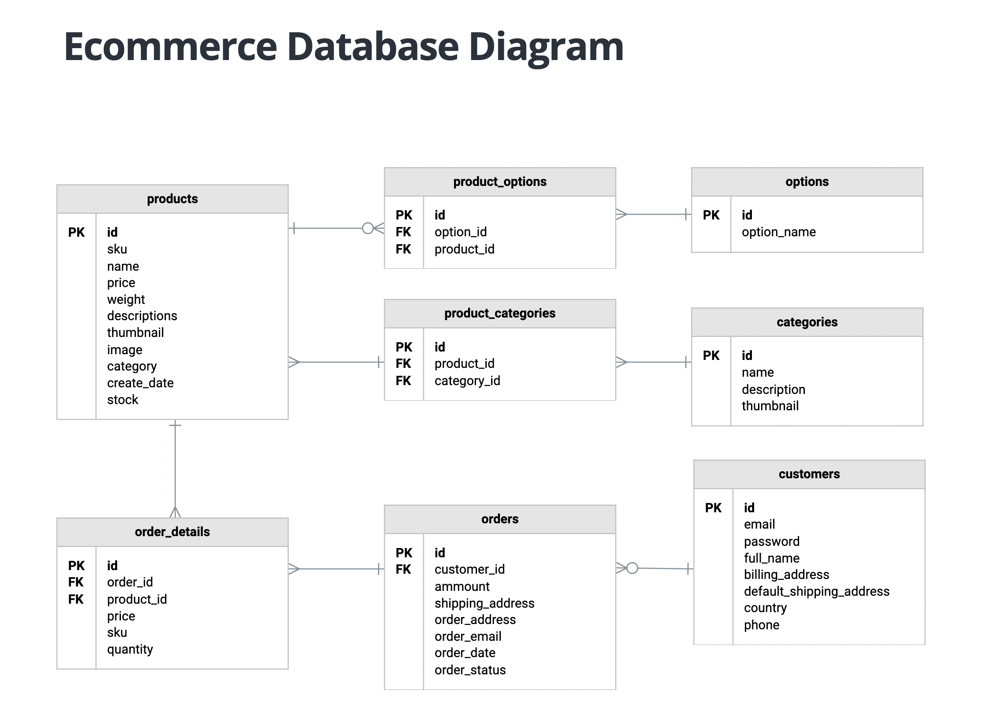

# SQL
This aim of this project is to write the database schema for a complex e-commerce website. The image of the DB is shown below;

## usage
To use this database schema;
+ copy the code in the `e_commerce_schema.sql` file and paste into a `_name_.sql` file and copy the code in `create_db.sql` file 
+ create your database by running `cat create_db.sql | sudo mysql -hlocalhost -uroot -p` in your terminal
+ In your terminal, run `cat _name_.sql | sudo mysql -hlocalhost -uroot -p e_commerce` to create the tables from this schema.

If everything went well, you will not get a prompt. You will only get a prompt when there is an error in your code.

### confimation
To confirm if your tables are created;

You can also use the mysql interactive shell to view your table;

+ `sudo mysql -uroot -p`
+ `use e_commerce`
+ `show tables`

_The project is a capstone project for **The Python Backend Growth Tracker** by Bahdcoder_
